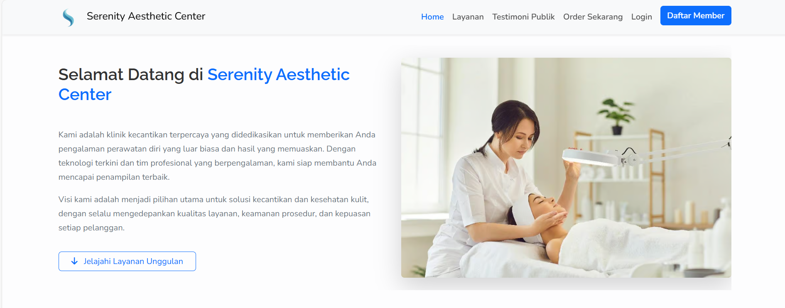

# Proyek Website Klinik Kecantikan

Aplikasi web sederhana untuk sebuah klinik kecantikan, dibangun dengan PHP native dan MySQL. Memungkinkan member untuk melihat layanan, order, memberi testimoni, dan mengelola profil. Admin memiliki dashboard untuk manajemen data.

## Fitur Utama

* **Member:** Registrasi, login, lihat layanan, order, riwayat order, buat & kelola testimoni pribadi, edit profil & password.
* **Admin:** Login khusus, dashboard statistik, kelola member, kelola layanan (CRUD dengan soft delete), kelola order (ubah status), kelola testimoni (approve/reject/delete).
* **Frontend:** Halaman utama dengan slider layanan unggulan (SwiperJS), testimoni promo, CTA, footer informatif.
* **Lainnya:** Desain responsif dengan Bootstrap 5, navigasi & tema konsisten.

